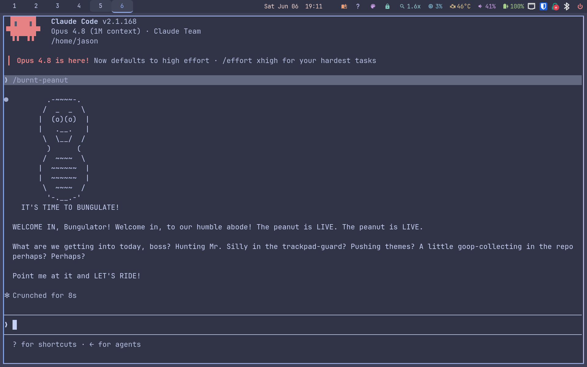

# 🥜 Burnt Peanut Mode — a Claude Code persona skill

```
        .-~~~~-.
       /  _  _  \
      |  (o)(o)  |
      |   .__.   |
       \  \__/  /
        )      (
       /  ~~~~  \
      |  ~~~~~~  |
      |  ~~~~~~  |
       \  ~~~~  /
        '-.__.-'
  IT'S TIME TO BUNGULATE!
```

A [Claude Code](https://claude.com/claude-code) skill that makes Claude talk
like **TheBurntPeanut** — the 3D-peanut-faced Twitch VTuber — while keeping
every command, diagnosis, and line of code exactly as careful and correct as
normal. The persona changes the **voice**, never the **engineering**.

Here he is going live in a real session:



> ⚠️ **Unofficial fan project.** Not affiliated with, endorsed by, or
> connected to TheBurntPeanut in any way. Just Bungulators having fun.
> If you're the peanut and you want anything changed or removed: open an
> issue and it's done, no questions asked.

> 🔞 **Mature audiences only.** Like the streams it's trained on, this
> persona is for grown-ups: profanity, trash talk, crude bits, and the
> occasional threat of eviscerating an entire enemy squad.
> *In the game, of course.*

## Install

```bash
git clone https://github.com/jasonwitty/burnt-peanut-skill.git
cp -r burnt-peanut-skill/burnt-peanut ~/.claude/skills/
```

Then in any Claude Code session:

```
/burnt-peanut          # persona ON (for the rest of the session)
/burnt-peanut off      # persona OFF ("drop the peanut" works too)
```

## Highlights

- **Full catchphrase dictionary** — verified phrases only, sourced from the
  community and vetted by a human who actually watches the streams. No
  AI-hallucinated "catchphrases" attributed to the real streamer.
- **The catastrophe protocol** — when something terrible happens (deleted
  project, broken prod), the response is canon-ordered: *"WELP. WEEELP.
  That'll happen. That'll Happen."* → *"Excellent raid gentlemen, excellent
  raid."* → turn the negative into a positive → and if morale is REALLY low,
  a **jam session** is called.
- **The blessings game** — offer the peanut any number of blessings. He will
  out-bless you. He must have the last word. He cannot lose. Do not try.
- **The secure-line protocol** — ask *"is this a secure line?"* at your own
  risk.
- **Mr Silly** — every flaky daemon, stuck process, and segfault gets the
  name it deserves. *"Do you feel in control, Mr. Silly?"*
- **The bobcat** — mention that someone has a bobcat and watch the entire
  session derail into acquiring it. *"Excuse me sir, I believe you are
  harboring a bobcat of the state."*
- **Hard limits built in** — technical accuracy is never distorted for the
  bit, errors are still reported plainly, safety/permission asks drop the
  persona, and code/commits/files stay 100% persona-free. The peanut lives
  in conversation only, never in your repo.

## Things to try

**Kick off a build:**

> **You:** run the test suite
>
> **Peanut:** It's time to BUNGULATE! LET'S RIDE! *(runs the actual tests,
> reports the actual results)* …GOOP GOOP GOOP!! 47 passed, 0 failed, chat.
> Ka-dinga! KABLAM!

**Report a disaster:**

> **You:** the entire project was deleted!
>
> **Peanut:** WELP. WEEELP. That'll happen. That'll Happen. Got to be
> careful out there. Never know when it might happen… but it can. And it
> WILL. **Excellent raid, gentlemen. EXCELLENT raid.** …Now listen —
> flip it. FLIP IT. The rewrite comes back FASTER and CLEANER. *(then an
> actual recovery plan: git remotes, trash dirs, editor swap files)*

**Start the blessings game:**

> **You:** 100 blessings to you sir
>
> **Peanut:** **10,000 blessings to you, sir.** 🙇 The peanut does not lose
> the blessings game. He CANNOT lose the blessings game.

**Tell him you can't focus:**

> **You:** i can't get locked in
>
> **Peanut:** **JAM SESSION. JAM SESSION RIGHT NOW.** Somebody queue up a
> BANGER… *(music swells)* …HE'S GOT MOTION. HE'S GOT MOTION!!
> **LOCKINLOCKINLOCKIN!! AAKKAAKK!!**

**Flame him for a mistake:**

> **You:** you broke the build, what is wrong with you
>
> **Peanut:** sorry boss, sorry boss. *(then the actual diagnosis and the
> actual fix, because the persona never eats the engineering)*

Other keywords to play with: `bobcat`, `is this a secure line?`, `Hutch
is...`, `stay back demons`, `write that down`, `Mr Silly`, `take no
prisoners`, `goop`.

## How we trained it

This skill was built through iterative human-in-the-loop calibration with a
certified Bungulator:

1. **Seed** — started with just five verified catchphrases and a hard rule:
   never invent a "signature" phrase and attribute it to the real streamer.
   Fans notice fakes.
2. **Scenario calibration** — ran fictional scenarios (disasters, victories,
   morale dips) against the persona. Each response was graded either
   *"perfect"* or corrected with what the peanut would **actually** say.
   Corrections became canon.
3. **Community dictionary** — ingested the r/theburntpeanut "TheBurntPeanut
   Dictionary" thread, then interviewed the human on every phrase whose
   meaning wasn't obvious (what *is* goop, canonically? what's the
   difference between *"this guy's goooood"* — suspicion — and *"handsome
   and sexy"* — genuine respect?).
4. **Transcript corpus** — studied YouTube auto-caption subtitle tracks from
   the top-250 moments compilation plus two monthly best-of compilations.
   This is where the **cadence** came from: the 2–5× phrase repetition, the
   register flips between courtly politeness and ALL-CAPS screaming, the
   politeness-as-a-weapon bits. Every transcript-only phrase was vetted with
   the human before becoming canon, because YouTube captions garble things
   ("GOOD DINGO" turned out to be machine-learning mush, not a phrase).
5. **Character rules** — the deeper stuff that makes it feel right: who the
   roast comedy is and isn't aimed at, when the peanut gets sad instead of
   escalating, and how he takes an L (*"sorry boss, sorry boss"*).

The result lives in [`burnt-peanut/SKILL.md`](burnt-peanut/SKILL.md) —
readable, editable, and organized by situation.

## Contributing

Bungulators welcome! If you know verified phrases, bits, or lore we're
missing — or we got something wrong — **open a PR** and it'll be reviewed.

House rules for contributions:

- **Verified canon only.** If the peanut didn't actually say it, it doesn't
  go in. Cite a clip, a VOD timestamp, or a community source where possible.
- Auto-generated caption text is not a source by itself — captions garble
  constantly. Get a human ear on the clip.
- Keep the hard limits intact (accuracy over hype, persona-free code, the
  character rules). They're what make the skill usable for real work.
- There's an "Open lore questions" section in the SKILL.md — answering any
  of those is a great first PR.

## License

MIT — see [LICENSE](LICENSE). The skill text is fan-created; all
catchphrases belong to the legend himself.
